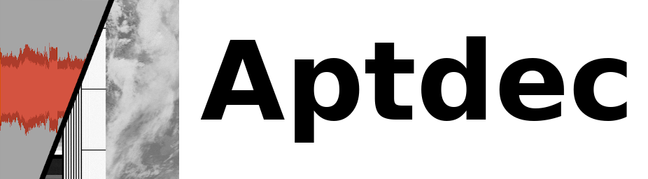

Copyright (c) 2004-2009 Thierry Leconte (F4DWV), Xerbo (xerbo@protonmail.com) 2019-2022

[](https://github.com/Xerbo/aptdec/actions/workflows/build.yml)

## Introduction

Aptdec is a FOSS program that decodes images transmitted by NOAA weather satellites. These satellites transmit constantly (among other things) medium resolution (4km/px) images of the earth over a analog mode called APT.
These transmissions can easily be received with a cheap SDR and simple antenna. Then the transmission can be decoded in narrow FM mode.

Aptdec can turn the audio recordings into PNG images and generate images such as:

 - Raw image: both channels with full telemetry included
 - Individual channel: one of the channels form the image
 - Temperature image: a temperature compensated image derived from the IR channel
 - Palleted image: a image where the color is derived from a palette (false color, etc)

The input audio format can be anything supported by `libsndfile` (although only tested with WAV and FLAC). Sample rate doesn't matter, although lower samples rates will process faster.

## Quick start

```sh
sudo apt install cmake git gcc libsndfile-dev libpng-dev
git clone --recursive https://github.com/Xerbo/aptdec.git && cd aptdec
cmake -B build
cmake --build build
# Resulting binary is build/aptdec
```

## Examples

To create an image from `gqrx_20200527_115730_137914960.wav` (output filename will be `gqrx_20200527_115730_137914960-r.png`)
```sh
./aptdec gqrx_20200527_115730_137914960.wav
```

To manually set the output filename
```sh
./aptdec -o image.png gqrx_20200527_115730_137914960.wav
```

Decode all WAV files in the current directory and put them in `images`
```sh
mkdir images && ./aptdec -d images *.wav
```

Apply a denoise filter (see [Post-Processing Effects](#post-processing-effects) for a full list of post-processing effects)
```sh
./aptdec -e d gqrx_20200527_115730_137914960.wav
```

Create a temperature compensated image for NOAA 18
```sh
./aptdec -i t -s 18 gqrx_20200527_115730_137914960.wav
```

Apply a falsecolor palette
```sh
./aptdec -i p -p palettes/WXtoImg-N18-HVC.png gqrx_20200527_115730_137914960.wav
```

## Usage

### Arguments

```
-i [r|a|b|t|m|p] Output type (stackable)
-e [t|h|l|d|p|f] Effects (stackable)
-o <path>        Output filename
-d <path>        Destination directory
-s (15-19)       Satellite number
-p <path>        Path to palette
-r               Realtime decode
-g               Gamma adjustment (1.0 = off)
```

### Image output types

 - `r`: Raw Image
 - `a`: Channel A
 - `b`: Channel B
 - `t`: Temperature
 - `p`: Palleted

### Post-Processing Effects

 - `t`: Crop telemetry (only effects raw image)
 - `h`: Histogram equalise
 - `l`: Linear equalise
 - `d`: Denoise
 - `p`: Precipitation overlay
 - `f`: Flip image (for northbound passes)
 - `c`: Crop noise from ends of image

## Realtime decoding

Aptdec even supports decoding in realtime. The following decodes the audio coming from the audio device `pulseaudio alsa_output.pci-0000_00_1b.0.analog-stereo`

```
mkfifo /tmp/aptaudio
aptdec -r /tmp/aptaudio
sox -t pulseaudio alsa_output.pci-0000_00_1b.0.analog-stereo.monitor -c 1 -t wav /tmp/aptaudio
```

To stop the decode and calibrate the image simply kill the `sox` process.

## Palette formatting

Palettes are just simple PNG images, 256x256px in size with 24bit RGB color. The X axis represents the value of Channel A and the Y axis the value of Channel B.

## Building for Windows

You can cross build for Windows from Linux with the `build_windows.sh` script, you will need the following:
```
sudo apt install wget cmake make mingw-w64 git unzip
```

To build natively on Windows using MSVC, you will also need: git, ninja and cmake. Then run:
```
.\build_windows.bat
```

If you just wish to build libaptdec on Windows, libpng and libsndfile aren't needed.

## Further Reading

[User's Guide for Building and Operating
Environmental Satellite Receiving Stations](https://noaasis.noaa.gov/NOAASIS/pubs/Users_Guide-Building_Receive_Stations_March_2009.pdf)  

[NOAA KLM coefficients](https://web.archive.org/web/20141220021557/https://www.ncdc.noaa.gov/oa/pod-guide/ncdc/docs/klm/tables.htm)

[NOAA Satellite specifications and more information](https://www1.ncdc.noaa.gov/pub/data/satellite/publications/podguides/N-15%20thru%20N-19/pdf/)

## License

See `LICENSE`
